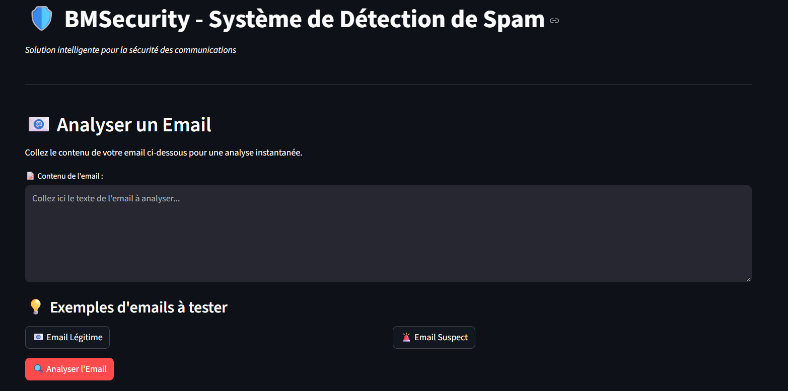

````markdown
# 🛡️ BMSecurity - Détecteur de Spam

Bienvenue dans **BMSecurity**, une application interactive de détection de spams par apprentissage automatique (ML) et traitement du langage naturel (NLP). Elle vous permet d’analyser des emails pour déterminer s’ils sont **légitimes** ou **malveillants (spams)** à l’aide de modèles pré-entraînés.

---

## 🚀 Démo en un coup d’œil



---

## 🎯 Objectifs du Projet

- Détecter automatiquement les emails de type **spam** à partir de leur contenu textuel
- Fournir une **analyse de confiance**, des **recommandations**, et des **visualisations**
- Offrir une **interface simple et rapide** grâce à **Streamlit**

---

## 🧠 Modèle de Machine Learning

- 🔍 **SVM (Support Vector Machine)** – *Modèle recommandé*
- 📊 **Naive Bayes Multinomial**
- 🌳 **Decision Tree Classifier**

✅ Tous les modèles sont testés avec validation croisée (5-fold) et optimisés avec `GridSearchCV`.

---

## 🧪 Pipeline de traitement

```text
Email Input → Prétraitement → TF-IDF Vectorizer → SVM Classifier → Résultat

Étapes :
- Tokenisation
- Nettoyage
- Suppression des stopwords
- Stemming
- Extraction de caractéristiques (TF-IDF)
- Prédiction avec modèle SVM
````

---

## 🧰 Technologies utilisées

| Outil / Lib              | Rôle                                                    |
| ------------------------ | ------------------------------------------------------- |
| **Python 3.8+**          | Langage principal                                       |
| **Streamlit**            | Application web                                         |
| **Scikit-learn**         | Modèles ML et vectorisation                             |
| **NLTK**                 | Traitement de texte (tokenisation, stopwords, stemming) |
| **Matplotlib / Seaborn** | Visualisation                                           |
| **WordCloud**            | Analyse lexicale                                        |

---

## 📦 Installation

1. **Clone le repo :**

```bash
git clone https://github.com/ton_projet/bmsecurity-spam-detector.git
cd bmsecurity-spam-detector
```

2. **Installe les dépendances :**

```bash
pip install -r requirements.txt
```

3. **Lance l'application Streamlit :**

```bash
streamlit run app.py
```

---

## 📂 Structure du projet

```text
📦 bmsecurity-spam-detector/
├── app.py                      # Application principale Streamlit
├── models/
│   ├── spam_detection_model.pkl     # Modèle SVM entraîné
│   └── tfidf_vectorizer.pkl         # TF-IDF vectorizer
├── plots/
│   ├── comparaison_performances_models.png
│   ├── confusion_models.png
│   ├── word_cloud.png
│   └── distribution.png
├── requirements.txt            # Dépendances Python
└── README.md                   # Ce fichier
```

---

## 📊 Performances

| Modèle           | Accuracy  | Precision | Recall    | F1-score  |
| ---------------- | --------- | --------- | --------- | --------- |
| 🌳 Decision Tree | 95.6%     | 96.1%     | 95.9%     | 96.0%     |
| 📊 Naive Bayes   | 98.1%     | 97.7%     | 98.7%     | 98.2%     |
| 🎯 SVM (reco.)   | **98.7%** | **98.2%** | **99.4%** | **98.8%** |

---

## 📈 Fonctionnalités clés

* Analyse temps réel d'un email (copier-coller)
* Visualisation des probabilités (`spam` vs `ham`)
* Wordcloud des spams vs emails légitimes
* Recommandations de sécurité selon le niveau de confiance
* Statistiques détaillées et matrices de confusion

---

## 🔍 Aperçu des visualisations

| Type de graphique          | Description                   |
| -------------------------- | ----------------------------- |
| 📊 Comparaison des modèles | Accuracy / Recall / Precision |
| 🔍 Matrices de confusion   | Erreurs de classification     |
| ☁️ WordCloud               | Lexique fréquent              |
| 📏 Distribution            | Longueur / mots               |

---

## 🧠 Insights du modèle

* Les spams utilisent souvent des mots : `"free"`, `"win"`, `"money"`, `"offer"`
* Les emails légitimes ont plus de détails, de longueur, et un ton professionnel
* La vectorisation TF-IDF avec bigrammes améliore la précision

---

## 🔐 Perspectives

* 🔮 Intégration Deep Learning (LSTM, Transformers)
* 🌍 Support multilingue
* ⏱️ Détection en continu (streaming)
* 🔗 Intégration avec des APIs de messagerie

---

## 👤 À propos

> Ce projet a été conçu par **BMSecurity AI Team** pour renforcer la cybersécurité par le Machine Learning.

📧 Contact : [yonlifidelis2@gmail.com](mailto:yonlifidelis2@gmail.com)
🔗 LinkedIn : [yonlifidele](https://www.linkedin.com/in/yonlifidele)
📅 Version : 1.0.0 (Juillet 2025)

---

## ✅ Licence

Ce projet est distribué sous licence **MIT** – Vous pouvez l'utiliser librement, le modifier et le partager.

---

**🛡️ BMSecurity – Protégez vos communications grâce à l'intelligence artificielle.**

```
